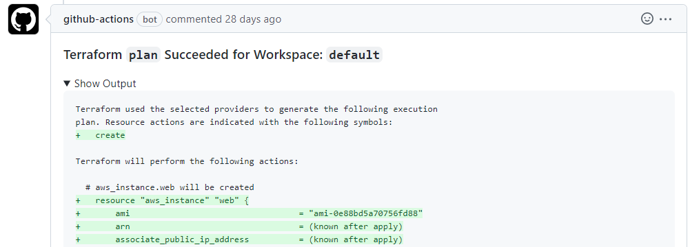
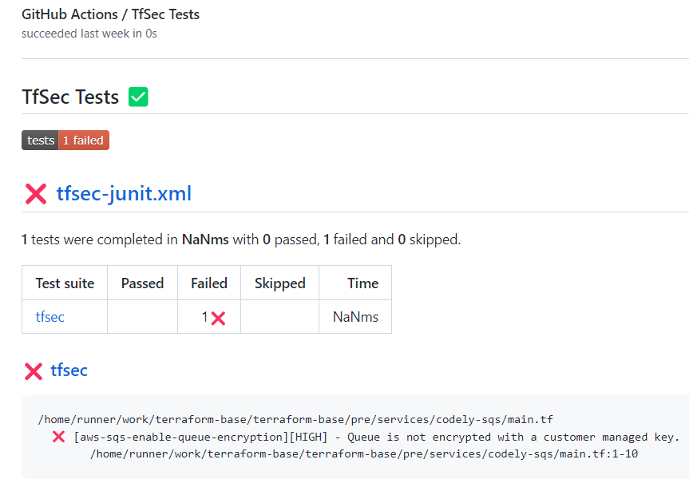
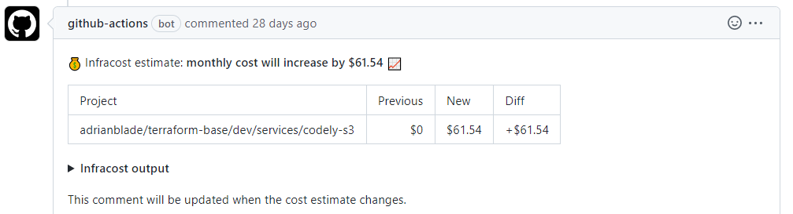

  

<h1 align="center">
  🪐 Terraform CI/CD - terragrunt - tfsec - infracost
</h1>

This repository contains a basic Terraform CI/CD. Designed to store all the IaC code on a mono-repo with high tfstate granularity. Supports multi-account and regions.

Here you have the course explaining all the examples available in this repository: [Terraform: Buenas prácticas llevando tu infraestructura a código](https://pro.codely.com/library/terraform-buenas-practicas-llevando-tu-infraestructura-a-codigo-193451/479241/about/) (Spanish)

## Contents

This project has been designed as an incremental learning path to Terraform. Each folder increments the concepts and usages of previous folders. 

Each folder correspond to one of [the course videos](https://pro.codely.com/library/terraform-buenas-practicas-llevando-tu-infraestructura-a-codigo-193451/479241/about/):

1. 🚀 ¿Para qué sirve Terraform? ¿Qué aprenderás en el curso?
   1. ⚙️ [YouTube] IaC vs GitOps vs DevOps
   2. [⚡️ Instalación y configuración de Terraform](1-first-steps/1.2-terraform-install)
   3. 👨‍🎓 Crear y configurar cuenta de AWS
2. 👶 Despliega tu primera pieza de infraestructura
   1. [📘 Crea un bucket de S3 en AWS](2-deploy-your-first-infrastructure-resource/2.1-s3-bucket)
   2. [🧩 Flujo de trabajo en Terraform: Init, Plan y Apply](2-deploy-your-first-infrastructure-resource/2.2-init-plan-apply)
   3. [🔑 Data Sources: Obteniendo acceso al bucket](2-deploy-your-first-infrastructure-resource/2.3-datasources)
3. 🙏 ¿Y si mi infraestructura ya existe antes de conoceros?
   1. 😮 Me ha aparecido un fichero en local: `tfstate`
   2. 🧡 Importar recursos a Terraform
4. 🚀 Trabajo en equipo con Terraform
   1. ☁️ Backends remotos en otros cloud
   2. [💾 Guardando el `tfstate` en un bucket de s3](4-teamwork-with-terraform/4.2-remote-backends)
   3. [🔐 Bloqueando el `tfstate` con dynamodb](4-teamwork-with-terraform/4.3-state-locking)
5. ⛓️ Conectar piezas de infraestructura
   1. [🧩 Desplegar piezas por separado: S3, Lambda y DynamoDB](5-connecting-infrastructure-resources/5.1-lambda-and-dynamodb)
   2. [🧙‍♂️ Conectar las piezas de infraestructura](5-connecting-infrastructure-resources/5.2-connecting-pieces)
6. 🎸 Terraform mantenible con múltiples equipos
   1. 👐 Terraform agnóstico de la plataforma: LA GRAN MENTIRA
   2. [🗃️ Consigue rapidez y evita drift en Terraform: Separa los `tfstates`](6-maintainable-terraform-with-multiple-teams/6.2-repository-structure)
   3. [👥 Terraform Workspaces: Reutiliza configuración entre entornos](6-maintainable-terraform-with-multiple-teams/6.3-terraform-workspaces)
   4. [🚄 Separar `tfstates`: Ejemplo práctico de El Mundo Real™️](6-maintainable-terraform-with-multiple-teams/6.4-split-tfstate)
7. 💙 Simplifica tu proyecto con Terragrunt
   1. [👐 Reutilizando recursos entre distintos entornos](7-simplify-your-project-with-terragrunt/7.1-terragrunt-environments)
   2. [🦹‍♀️ Gestionando varios providers con Terragrunt](7-simplify-your-project-with-terragrunt/7.2-terragrunt-providers)
   3. 🤏 Por qué Mango NO usa Terraform Workspaces
8. 🤖 Automatizando despliegues de Terraform con GitHub y Jenkins
   1. [🥉 Validamos sintaxis de Terraform en GitHub Actions](8-automating-deploy-with-github-and-jenkins/8.1-workflow-validate)
   2. 🥇 Desplegando Terraform desde GitHub Actions
      1. [Workflow plan](8-automating-deploy-with-github-and-jenkins/8.2.1-workflow-plan)
      2. [Workflow apply](8-automating-deploy-with-github-and-jenkins/8.2.2-workflow-apply)
   3. [🦿 GitHub Actions vs Jenkins](8-automating-deploy-with-github-and-jenkins/8.3-github-actions-jenkinsfile)
9. ⚙️ Buenas prácticas y utilidades para Terraform
   1. [💵 Cuánto estoy gastando: Infracost](9-best-practices-and-tooling/9.1-infracost)
   2. 🧪 Testing en Terraform ¿Sí o no?
   3. 🔝 Top 5 utilidades para Terraform
10. 🔜 Conclusiones y siguientes pasos
    1. 💣 Aprendizajes del mundo real: Detección automática de Drift
    2. 🤟 Conclusión y siguientes pasos

## Requirements

- Terraform v.1.2.0+
- Terragrunt v0.38.0+
- Tfenv
- AWS account (free tier)
- 
## GitHub actions - Workflows

## Screenshots

