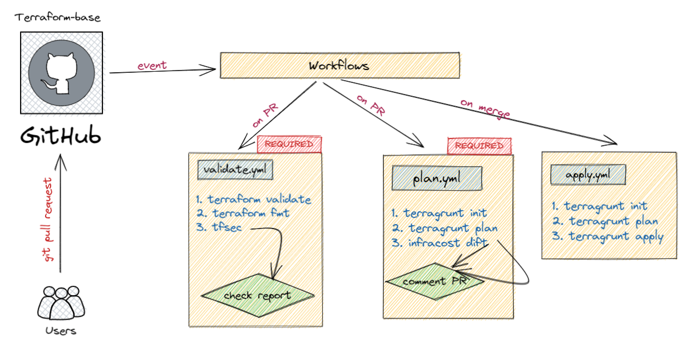

  

<h1 align="center">
  🐘🎯 Terraform CICD - terragrunt - tfsec - infracost
</h1>

This repository contains a basic Terraform CICD. Designed to store all the IaC code on a mono-repo with high tfstate granularity. Supports multi-account and regions.

### Requirements

- Terraform v.1.2.0+
- Terragrunt v0.38.0+
- Tfenv
- AWS account (free tier)

### Contents

This project has been designed as an incremental learning path to Terraform. Each folder increments the concepts and usages of previous folders. 

Each folder corresponds to one of the course lessons / videos:
1. [`1.2-terraform-install`](./1.2-terraform-install) - Instalación de Terraform
1. [`2.1-s3-bucket`](./2.1-s3-bucket) - Crear un bucket de S3 en AWS con Terraform
1. [`2.2-init-plan-apply`](./2.2-init-plan-apply) - Flujo de trabajo con Terraform: Init, Plan y Apply
1. [`2.3-datasources`](./2.3-datasources) - Datasources: Obteniendo acceso al bucket
1. [`4.2-remote-backends`](./4.2-remote-backends) - Guardando el tfstate en un bucket de S3
1. [`4.3-state-locking`](./4.3-state-locking) - Bloqueando el tfstate con DynamoDB
1. [`5.1-lambda-and-dynamodb`](./5.1-lambda-and-dynamodb) - Desplegando piezas: S3, Lambda y DynamoDB
1. [`5.2-connecting-pieces`](./5.2-connecting-pieces) - Conectar las piezas de infraestructura
1. [`6.2-repository-structure`](./6.2-repository-structure) - Estructura del repositorio de Terraform
1. [`6.3-terraform-workspaces`](./6.3-terraform-workspaces) - Terraform workspaces
1. [`6.4-split-tfstate`](./6.4-split-tfstate) - Separar tfstates
1. [`7.1-terragrunt-environments`](./7.1-terragrunt-environments) - Terragrunt: Evitando DRY entre entornos
1. [`7.2-terragrunt-providers`](./7.2-terragrunt-providers) - Gestionando varios providers con Terragrunt
1. [`8.1-workflow-validate`](./8.1-workflow-validate) - Validando syntaxis de Terraform
1. [`8.2.1-workflow-plan`](./8.2.1-workflow-plan) - Desplegando Terraform con Github Actions PullRequest
1. [`8.2.2-workflow-apply`](./8.2.2-workflow-apply) - Desplegando Terraform con Github Actions Merge
1. [`8.3-github-actions-jenkinsfile`](./8.3-github-actions-jenkinsfile) - GitHub Actions vs Jenkinsfile
1. [`9.1-infracost`](./9.1-infracost) - ¿Cuánto estoy gastando? - Infracost

## GitHub actions - Workflows

## Screenshots

